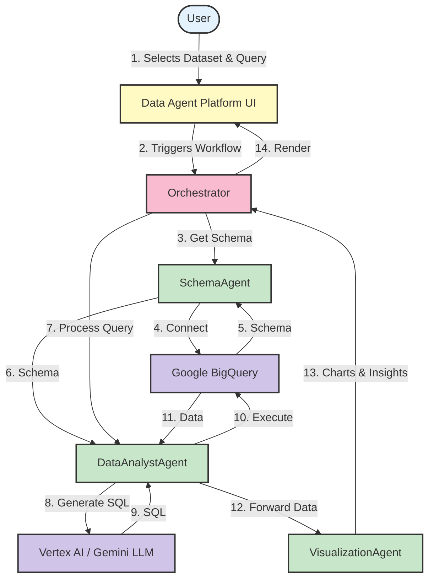

# System Architecture Diagram

This diagram provides a visual overview of the Data Agent Platform's architecture, illustrating the flow of information from the user to the backend services and back.

## Architecture Flow Description

1. **User Interaction**: The user selects a dataset and enters a natural language query through the web interface.

2. **Orchestration**: The Dash web app triggers the workflow in the Orchestrator.

3. **Schema Retrieval**: 
   - The Orchestrator requests schema information from the SchemaAgent.
   - SchemaAgent connects to Google BigQuery to fetch the dataset schema.
   - The schema is provided to the DataAnalystAgent for context.

4. **Query Processing**:
   - The DataAnalystAgent uses Vertex AI (Gemini LLM) to convert the natural language query into SQL.
   - The generated SQL is executed on Google BigQuery.
   - Query results are returned to the DataAnalystAgent.

5. **Visualization**:
   - The DataAnalystAgent forwards the structured data to the VisualizationAgent.
   - VisualizationAgent generates charts and insights from the data.
   - Results are sent back through the Orchestrator to be displayed in the web interface.

6. **Display**: The final output (tables, charts, and insights) is rendered in the user's browser.
