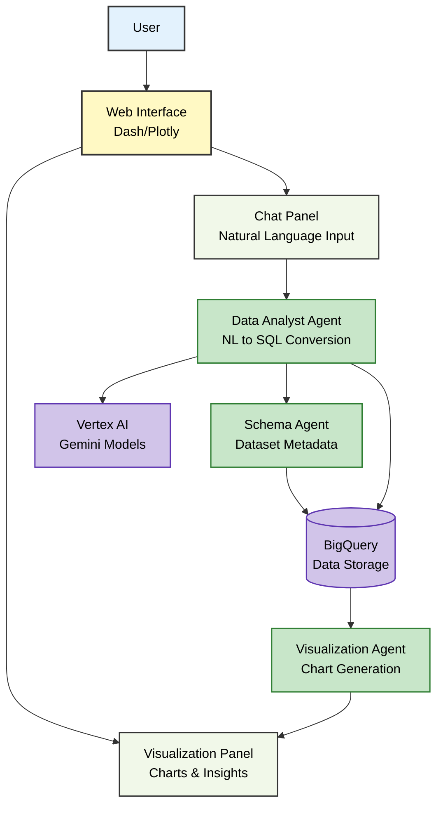

# Dynamic Data Agent Platform Architecture

## Visual Overview

## Architecture Flow

### 1. User Interaction
- User accesses the Dash web interface (app.py)
- Interacts with chat panel to enter natural language queries about BigQuery datasets
- Can select specific BigQuery datasets from dropdown menu

### 2. Chat Processing
- Chat panel captures user input and suggestion clicks
- Main callbacks (main_callbacks.py) handle chat interactions and coordinate agent responses
- Loading indicators provide feedback during processing

### 3. Data Analysis Flow
- **Data Analyst Agent** receives natural language query and dataset information
- **Schema Agent** retrieves BigQuery dataset schema and metadata
- **Data Analyst Agent** uses Vertex AI (Gemini models) to convert natural language to SQL
- Generated SQL is executed against BigQuery using BigQuery connector
- Query results are processed and formatted

### 4. Visualization Generation
- **Visualization Agent** processes query results to create appropriate charts
- Key insights are extracted and formatted for display
- Charts and data tables are rendered in the visualization panel

### 5. Response Display
- Processed results, visualizations, and insights are displayed in the right panel
- Chat history maintains conversation context
- Theme toggle allows switching between light/dark modes

## Technical Components

### Frontend (Dash/Plotly)
- **Main Layout** (`layouts/main_layout.py`): Two-panel layout with chat and visualization areas
- **Chat Panel** (`layouts/chat_panel.py`): Natural language input interface
- **Visualization Panel** (`layouts/visualization_panel.py`): Charts, tables, and insights display
- **Constants** (`constants.py`): Component IDs and configuration

### Backend Agents
- **Data Analyst Agent** (`agents/data_analyst_agent.py`): Natural language to SQL conversion and query execution
- **Schema Agent** (`agents/schema_agent.py`): BigQuery dataset metadata retrieval
- **Visualization Agent** (`agents/visualization_agent.py`): Chart generation and data visualization

### Cloud Services Integration
- **Google BigQuery**: Data storage and SQL query execution via BigQuery connector
- **Vertex AI**: Gemini models for natural language processing and SQL generation
- **BigQuery Tools** (`adk_tools/bigquery_tool.py`): ADK-based tools for BigQuery operations

### Key Features
- Real-time natural language to SQL conversion
- Interactive chat interface with suggested queries
- Dynamic visualization generation based on query results
- Multi-dataset support with schema-aware querying
- Dark/light theme support
- Error handling and fallback mechanisms

This architecture provides an AI-powered data analysis platform where users can interact with BigQuery datasets using natural language, with intelligent agents handling the complex tasks of SQL generation, data retrieval, and visualization creation.
