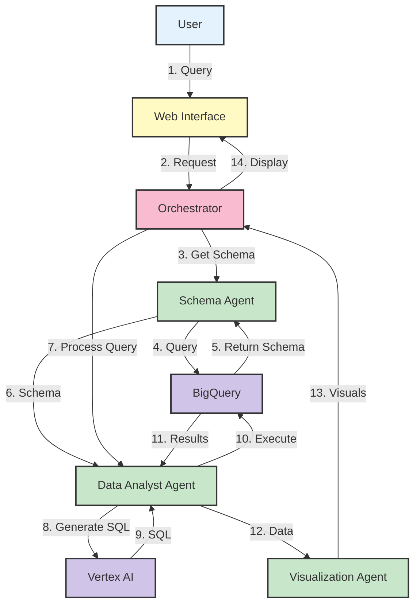

# System Architecture

## Visual Overview

## Architecture Flow

### 1. User Interaction
- User accesses the web interface
- Selects a dataset and enters a natural language query

### 2. Request Handling
- Web interface sends the request to the Orchestrator

### 3. Schema Retrieval
- Orchestrator requests schema information from Schema Agent
- Schema Agent queries BigQuery for the dataset structure
- Schema is returned and passed to Data Analyst Agent

### 4. Query Processing
- Data Analyst Agent uses Vertex AI to convert natural language to SQL
- SQL is executed on BigQuery
- Query results are returned to the Data Analyst Agent

### 5. Visualization
- Results are sent to Visualization Agent
- Charts and insights are generated
- Final output is returned to the web interface

## Technical Components

### Frontend
- **Web Interface**: Built with Dash/Plotly for interactive visualizations

### Backend Services
- **Orchestrator**: Manages workflow between components
- **Schema Agent**: Handles dataset metadata and structure
- **Data Analyst Agent**: Processes natural language queries
- **Visualization Agent**: Generates charts and insights

### Cloud Services
- **Google BigQuery**: Data storage and query execution
- **Vertex AI**: Natural language processing and SQL generation

This architecture ensures a smooth flow from user query to data visualization while maintaining clear separation of concerns between components.
