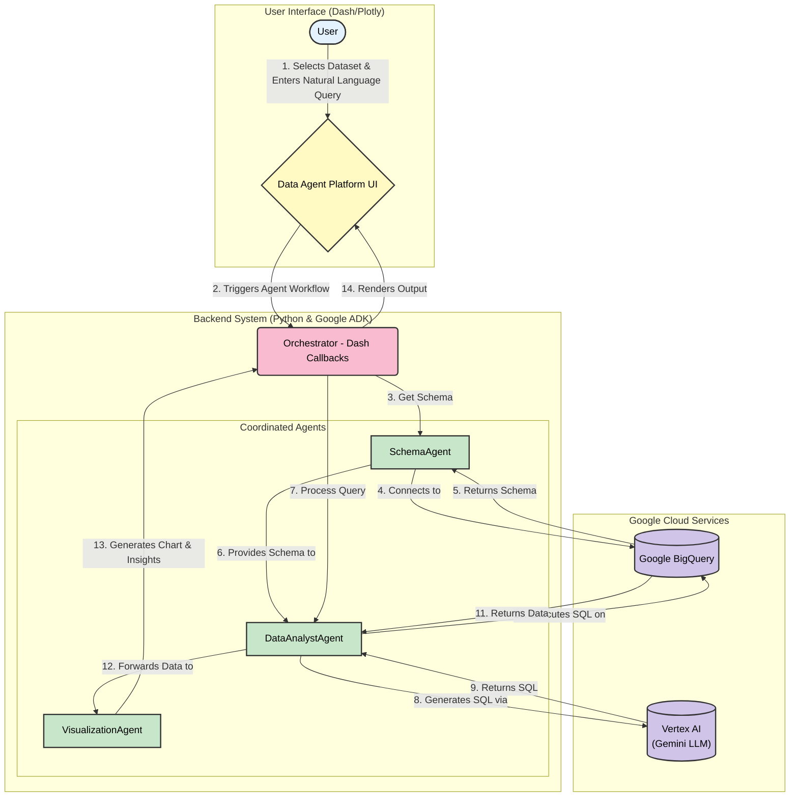

# System Architecture Diagram

This diagram provides a visual overview of the Data Agent Platform's architecture, illustrating the flow of information from the user to the backend services and back.

